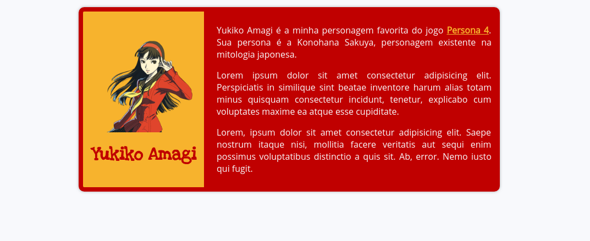

# [EXERCÍCIOS] Reconhecendo estruturas HTML

Vamos **IGNORAR** o CSS desses arquivos por enquanto! É difícil, eu sei, mas a gente consegue :)

A ideia desses exercícios é olhar uma imagem e perceber qual é o mínimo de elementos necessários para fazermos com que essa página fique dessa forma. Teremos, na ordem: a imagem para ser analisada, a resposta com a estrutura mínima necessária e o código no Codepen para maiores interações.

- [EXERCÍCIO 1](#exercício-1-página-card-na-verdade-de-tributo)

### [EXERCÍCIO 1] Página (card, na verdade) de tributo

1. Onde queremos chegar

Uma página de tributo nada mais é que uma página de homenagem a algo ou alguém. A minha página é uma homenagem à Yukiko Amagi, uma personagem do meu jogo favorito e que eu gosto bastante. Segue imagem para analisar e criar o seu HTML:



2. Linha de pensamento

<details>
  <summary>Clique aqui para ver a linha de pensamento! Deixei assim para evitar possíveis spoillers</summary>

  Vamos começar a separar os elementos, pensando na ordem em que eles aparecem na tela. Dá pra usar a ordem inversa e funciona do mesmo jeito também :)

  - Temos uma parte branca que contém o nosso card. Nesse caso, podemos usar o `<body>` ou uma `<div>`, que será o *container* do nosso card. Vamos utilizar uma div aqui, para evitar aplicar estilos diretamente no `<body>`:
  ```html
    <div>
    </div>
  ```

  - Temos o elemento que conterá todo o conteúdo principal desse nosso tributo, o card em si! Podemos usar a tag `<main>` ou uma `<div>` para esse conteúdo. Optei por usar a tag `<main>`, pois esse elemento irá conter todo o conteúdo principal da página:
  ```html
    <div>
      <main>
      </main>
    </div>
  ```

  - Nosso card é dividido em duas partes: uma parte com a imagem e o título e outra parte com os textos explicativos. Nesse caso, vamos usar `<div>` para ambas:
  ```html
    <div>
      <main>
        <div></div>
        <div></div>
      </main>
    </div>
  ```

  - Na primeira parte, temos uma imagem e um título. Como esse título é o único título da página, utilizaremos a tag `<h1>`. Para a tag ``, é importante não esquecer de colocar o atributo [`alt`](https://tableless.com.br/o-poder-do-atributo-alt/) (texto alternativo ao utilizar um leitor de imagem ou se a imagem não for renderizada) e o atributo `src` (caminho de onde pegaremos a imagem a ser reproduzida):
  ```html
    <div>
      <main>
        <div>
          

          <h1>Nome para quem o tributo está sendo feito</h1>
        </div>

        <div></div>
      </main>
    </div>
  ```

  - Na segunda parte, temos vários parágrafos, que serão representados pela tag `<p>`, e, dentro de um deles, um link, que será representado pela tag `<a>` de anchor. Não podemos esquecer de colocar o atributo `href` para dizer qual a ~referência~ para onde o nosso ~hyperlink~ ira apontar:
  ```html
    <div>
      <main>
        <div>
          

          <h1>Nome para quem o tributo está sendo feito</h1>
        </div>

        <div>
          <p>Texto qualquer com um <a href="/caminho-para-o-link">link</a>.</p>

          <p>Outro texto qualquer</p>

          <p>Mais um texto só pra manter a quantidade</p>
        </div>
      </main>
    </div>
  ```  
</details>

3. Código final no codepen [aqui](https://codepen.io/juunegreiros/pen/bJBLQj)
